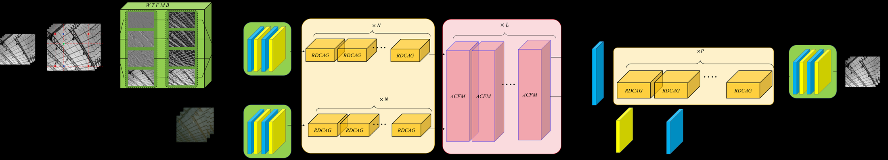
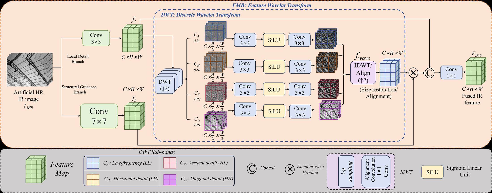

# WDTFuSR

<p align="center">
  <b>A Fusion-Guided Infrared Image Super-Resolution Network with Wavelet Modulation and Dense Transformer</b>
</p>

<p align="center">
  <a href="#"></a>
  <a href="#"></a>
  <a href="#"></a>
</p>

WDTFuSR reconstructs high-resolution infrared images from low-resolution infrared inputs with visible-image guidance.

## Architecture



## Highlights

- Wavelet modulation for infrared detail enhancement.
- Dense Transformer backbone for structure preservation.
- Attention-guided infrared-visible feature fusion.

## Downloads

| Resource | Link |
| --- | --- |
| Pretrained weights | [Google Drive](https://drive.google.com/file/d/1HyumFQTKD8-rKLHxWvMbQiLudf8IztIT/view?usp=sharing) |
| CIDIS dataset | [vision-cidis/CIDIS-dataset](https://github.com/vision-cidis/CIDIS-dataset) |

## Results

CIDIS-Test, x4 guided infrared super-resolution:

| Method | PSNR | SSIM |
| --- | ---: | ---: |
| Bicubic | 31.76 | 0.8971 |
| SRCNN | 33.17 | 0.9161 |
| FSRCNN | 33.14 | 0.9115 |
| VDSR | 34.56 | 0.9365 |
| EDSR | 35.28 | 0.9453 |
| SRDenseNet | 34.89 | 0.9401 |
| RDN | 35.40 | 0.9448 |
| RRDBNet | 35.18 | 0.9428 |
| SwinIR | 34.66 | 0.9410 |
| DRCT | 35.71 | 0.9477 |
| SwinFuSR | 35.92 | 0.9512 |
| **WDTFuSR** | **36.49** | **0.9552** |

## Module



## Usage

```bash
conda create --name WDTFuSR python=3.9
conda activate WDTFuSR
conda install pytorch torchvision pytorch-cuda=11.7 -c pytorch -c nvidia
pip install -r requirements.txt
```

Train:

```bash
python main_train_SwinFuSR.py --opt options/train_final.json
```

Test:

```bash
python test_SwinFuSR.py --opt options/test_swinFuSR.json
```

Before training or testing, update the dataset and checkpoint paths in `options/*.json`.

## Citation

```bibtex
@misc{yang2026wdtfusr,
  title  = {WDTFuSR: A Fusion-Guided Infrared Image Super-Resolution Network with Wavelet Modulation and Dense Transformer},
  author = {Yang, Shaohua and Mou, Xingang and Zhou, Xiao and Wang, Dongming},
  year   = {2026}
}
```

## Acknowledgements

This project is inspired by SwinFuSR, SwinFusion, and CoReFusion.
