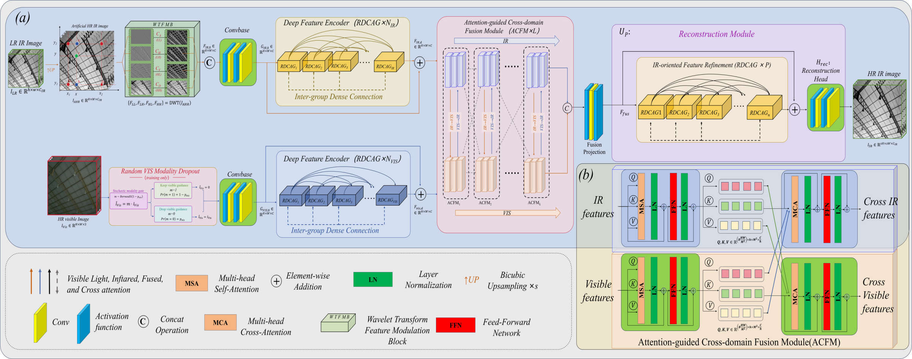
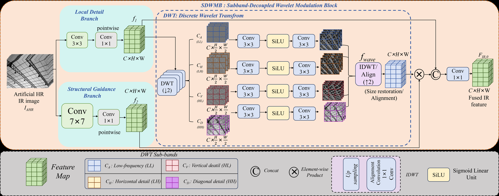
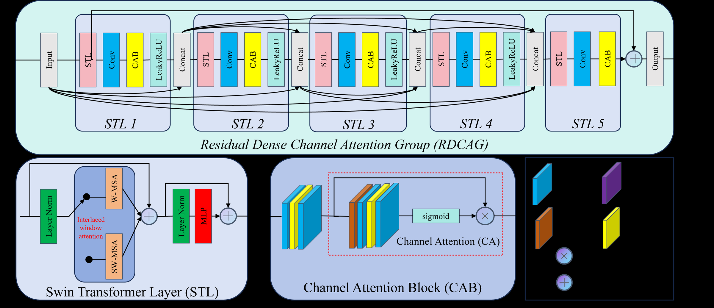
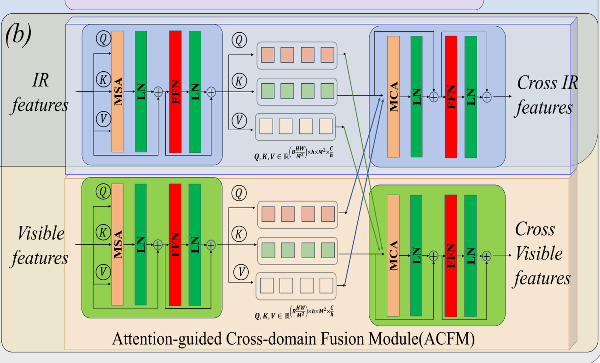
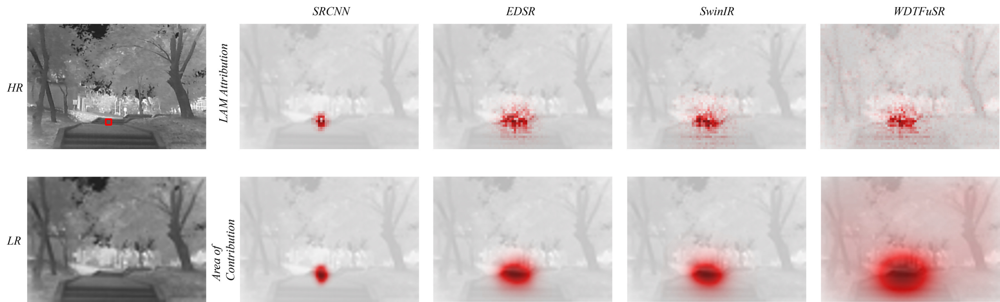

# WDTFuSR

<p align="center">
  <b>A Fusion-Guided Infrared Image Super-Resolution Network with Wavelet Modulation and Dense Transformer</b>
</p>

<p align="center">
  <a href="#"></a>
  <a href="#"></a>
  <a href="#"></a>
</p>

WDTFuSR reconstructs high-resolution infrared images from low-resolution infrared inputs with visible-image guidance.

## Architecture



WDTFuSR first refines infrared features with subband-decoupled wavelet modulation, then extracts dual-stream features and performs attention-guided cross-domain fusion for HR infrared reconstruction.

## Highlights

- Subband-decoupled wavelet modulation for infrared detail enhancement.
- Dense Transformer backbone for structure preservation.
- Attention-guided infrared-visible feature fusion.

## Downloads

| Resource | Link |
| --- | --- |
| Pretrained weights | [Google Drive](https://drive.google.com/file/d/1HyumFQTKD8-rKLHxWvMbQiLudf8IztIT/view?usp=sharing) |
| CIDIS dataset | [vision-cidis/CIDIS-dataset](https://github.com/vision-cidis/CIDIS-dataset) |

## Results

Mean PSNR/SSIM on CIDIS-Test. Learning-based results are averaged over three runs.

| Method | x2 PSNR | x2 SSIM | x4 PSNR | x4 SSIM | x6 PSNR | x6 SSIM |
| --- | ---: | ---: | ---: | ---: | ---: | ---: |
| Bicubic | 40.43 | 0.9823 | 31.76 | 0.8971 | 28.61 | 0.8230 |
| SRCNN | 41.61 | 0.9851 | 33.15 | 0.9159 | 30.07 | 0.8554 |
| FSRCNN | 41.58 | 0.9844 | 33.12 | 0.9113 | 30.04 | 0.8475 |
| VDSR | 42.79 | 0.9883 | 34.54 | 0.9363 | 31.53 | 0.8905 |
| EDSR | 43.40 | 0.9897 | 35.26 | 0.9451 | 32.29 | 0.9056 |
| SRDenseNet | 43.06 | 0.9889 | 34.86 | 0.9398 | 31.87 | 0.8967 |
| RDN | 43.50 | 0.9896 | 35.38 | 0.9446 | 32.41 | 0.9048 |
| RRDBNet | 43.31 | 0.9892 | 35.15 | 0.9425 | 32.17 | 0.9012 |
| SwinIR | 42.87 | 0.9890 | 34.64 | 0.9408 | 31.62 | 0.8981 |
| DRCT | 43.77 | 0.9900 | 35.68 | 0.9474 | 32.73 | 0.9096 |
| CoReFusion | 43.18 | 0.9887 | 34.71 | 0.9441 | 31.84 | 0.9015 |
| GuidedSR | 43.12 | 0.9889 | 34.66 | 0.9444 | 31.78 | 0.9021 |
| TnTViT-G | 43.56 | 0.9896 | 35.18 | 0.9473 | 32.36 | 0.9087 |
| FW-SAT | 43.73 | 0.9900 | 35.43 | 0.9491 | 32.61 | 0.9124 |
| SwinFuSR | 43.94 | 0.9906 | 35.89 | 0.9510 | 33.02 | 0.9164 |
| MSFFCT | 44.03 | 0.9907 | 35.97 | 0.9518 | 33.16 | 0.9180 |
| SwinPaste | 44.11 | 0.9909 | 36.10 | 0.9527 | 33.29 | 0.9198 |
| **WDTFuSR** | **44.42** | **0.9912** | **36.46** | **0.9550** | **33.68** | **0.9234** |

## Figures

### Subband-Decoupled Wavelet Modulation



SDWMB independently transforms Haar wavelet sub-bands and restores their spatial arrangement before modulation, strengthening infrared structure before cross-modal fusion.

### Residual Dense Channel Attention Group



RDCAG combines interlaced window attention, channel recalibration, dense reuse, and a residual path to preserve weak thermal structures.

### Attention-Guided Cross-Domain Fusion



ACFM performs bidirectional local cross-attention between infrared and visible streams while retaining both updated representations for reconstruction.

### LAM Analysis



LAM visualization shows that WDTFuSR uses a broader spatial context when reconstructing the selected target region.

## Usage

```bash
conda create --name WDTFuSR python=3.9
conda activate WDTFuSR
conda install pytorch torchvision pytorch-cuda=11.7 -c pytorch -c nvidia
pip install -r requirements.txt
```

Train:

```bash
python main_train_SwinFuSR.py --opt options/train_final.json
```

Test:

```bash
python test_SwinFuSR.py --opt options/test_swinFuSR.json
```

Before training or testing, update the dataset and checkpoint paths in `options/*.json`.
