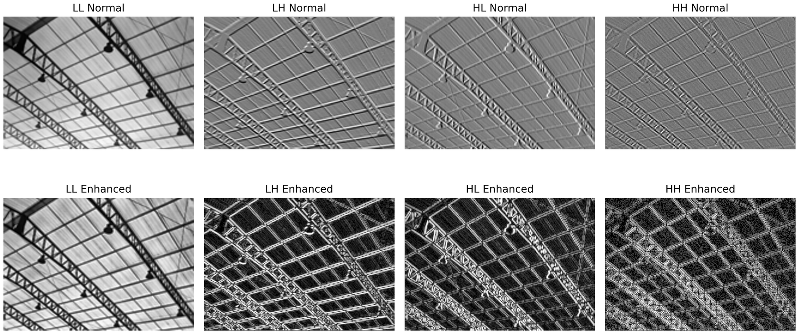

# WDTFuSR

<p align="center">
  <b>A Fusion-Guided Infrared Image Super-Resolution Network with Wavelet Modulation and Dense Transformer</b>
</p>

<p align="center">
  <a href="#"></a>
  <a href="#"></a>
  <a href="#"></a>
</p>

WDTFuSR is a guided infrared image super-resolution network that uses high-resolution visible images to help reconstruct sharper and cleaner infrared images.

## News

- Pretrained weights are available.
- Dataset link will be updated after release.

## Architecture


## Method Highlights

- Wavelet feature modulation for infrared detail enhancement.
- Dense Transformer feature extraction for stronger structure preservation.
- Attention-guided cross-domain fusion for visible-to-infrared texture transfer.
- Robust training strategy for missing or unreliable RGB guidance.

## Downloads

| Item | Link |
| --- | --- |
| Pretrained weights | [Google Drive](https://drive.google.com/file/d/1HyumFQTKD8-rKLHxWvMbQiLudf8IztIT/view?usp=sharing) |
| Dataset | To be updated |

## Results

CIDIS-Test, x4 guided infrared super-resolution:

| Method | PSNR | SSIM |
| --- | ---: | ---: |
| SwinFuSR | 35.92 | 0.9512 |
| **WDTFuSR (Ours)** | **36.49** | **0.9552** |

## Visualization




## Installation

```bash
conda create --name WDTFuSR python=3.9
conda activate WDTFuSR
conda install pytorch torchvision pytorch-cuda=11.7 -c pytorch -c nvidia
pip install -r requirements.txt
```

## Training

Update the dataset paths in `options/*.json`, then run:

```bash
python main_train_SwinFuSR.py --opt options/train_final.json
```

Other configurations:

```bash
python main_train_SwinFuSR.py --opt options/train_baseline.json
python main_train_SwinFuSR.py --opt options/train_augmentation.json
python main_train_SwinFuSR.py --opt options/train_x16.json
```

## Testing

Set `path/pretrained_netG` in `options/test_swinFuSR.json`, then run:

```bash
python test_SwinFuSR.py --opt options/test_swinFuSR.json
```

## Citation

```bibtex
@misc{yang2026wdtfusr,
  title  = {WDTFuSR: A Fusion-Guided Infrared Image Super-Resolution Network with Wavelet Modulation and Dense Transformer},
  author = {Yang, Shaohua and Mou, Xingang and Zhou, Xiao and Wang, Dongming},
  year   = {2026}
}
```

## Acknowledgements

This project is inspired by SwinFuSR, SwinFusion, and CoReFusion.
